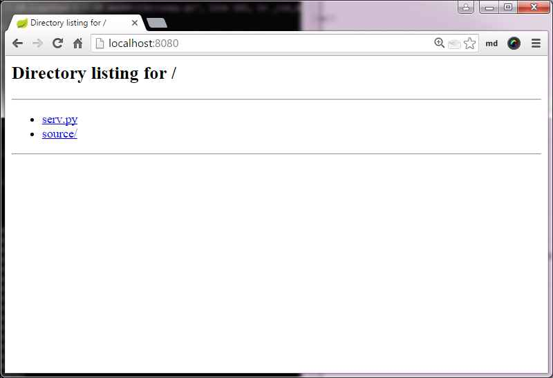
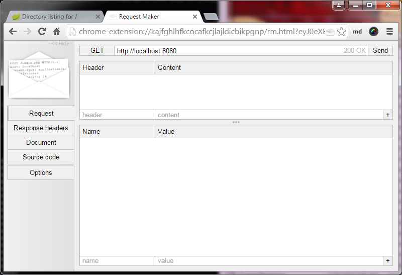
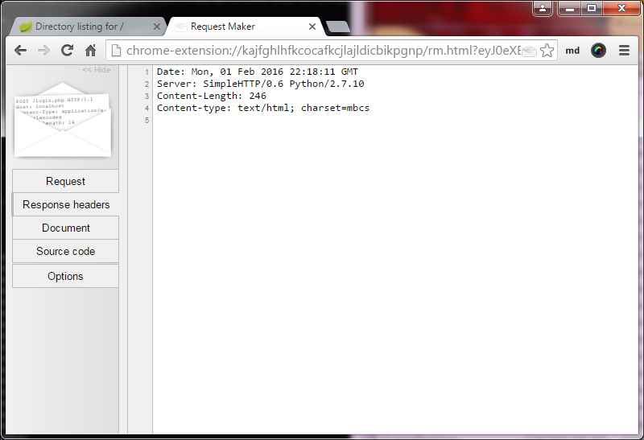
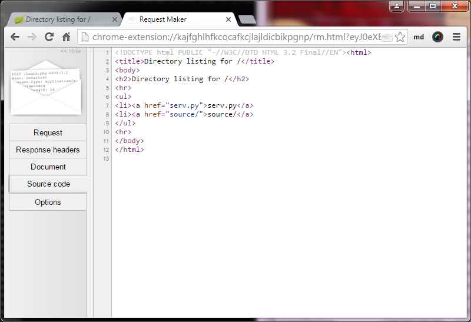
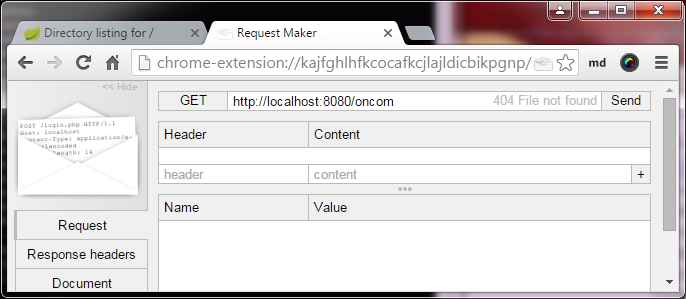
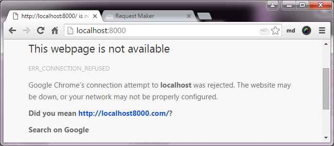
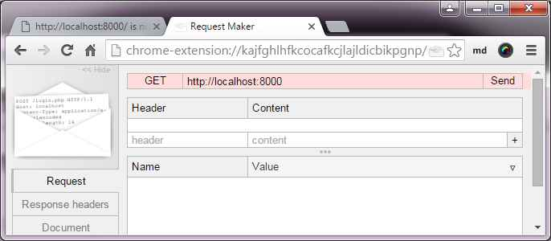
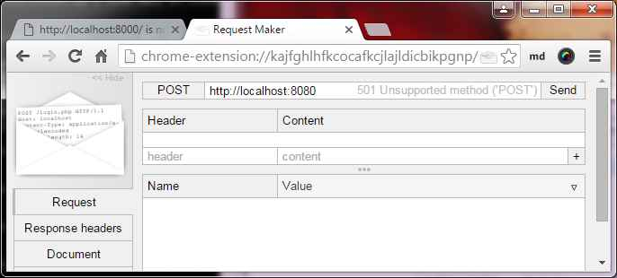
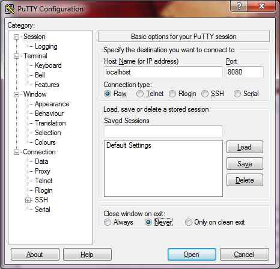

class: split-30 nopadding
background-image: url( https://cloud.githubusercontent.com/assets/4231611/11863079/6db975b4-a4c3-11e5-9c94-39747c1d2761.jpg )

.column_t2.center[.vmiddle[
.fgtransparent[
####&nbsp;
# <i class="icon-html fa-5x"></i>
]
]]
.column_t2[.vmiddle.nopadding[
.shadelight[.boxtitle1[
### KBTW Lab #1
# HTTP Basics

### [Eueung Mulyana](https://github.com/eueung)
### http://eueung.github.io/EL6240/http
#### EL-6240 | [Attribution-ShareAlike CC BY-SA](https://creativecommons.org/licenses/by-sa/4.0/)
#### 
]]
]]

---
class: column_t1 middle

.fonth4[
.tab1.fullwidth[
| Outline  |
|:-------------:|
| Tools |
| Quick Start |
| Beyond CLI - Put Some Codes |
]]

---
class: split-30 nopadding
background-image: url( https://cloud.githubusercontent.com/assets/4231611/11863079/6db975b4-a4c3-11e5-9c94-39747c1d2761.jpg )

.column_t2.center[.vmiddle[
.fgtransparent[
####&nbsp;
# <i class="icon-html fa-5x"></i>
]
]]
.column_t2[.vmiddle.nopadding[
.shadelight[.boxtitle1[
### 
# Tools

### 
### 
#### 
#### 
]]
]]

---
class: column_t1

.overlay.pos-bl-1[
<svg class="size512 shadowwhite" viewBox="0 0 1024 1024">
  <use xlink:href="images/minions.svg#minion1"></use>
</svg>
]

.overlay.pos-tr-1[.overlayc.top_60.size_300_200.xkcd_font.center.black[

This Checklist Please: <br/> .red[Python 2]<br/> Putty or Terminal<br/> .red[Request Maker / Postman (Chrome Ext./App.)]<br/> Text Editor<br/> .red[cURL]

]
<svg class="size800 fillwhite" viewBox="0 0 1024 1024">
  <use xlink:href="images/bubbles.svg#bubble1"></use>
</svg>
]

---
class: split-30 nopadding
background-image: url( https://cloud.githubusercontent.com/assets/4231611/11863079/6db975b4-a4c3-11e5-9c94-39747c1d2761.jpg )

.column_t2.center[.vmiddle[
.fgtransparent[
####&nbsp;
# <i class="icon-html fa-5x"></i>
]
]]
.column_t2[.vmiddle.nopadding[
.shadelight[.boxtitle1[
### 
# Quick Start

### 
### 
#### 
#### 
]]
]]

---
class: split-50 nopadding 

.column_t1[.vmiddle[


# SimpleHTTPServer

```bash

*$> python -m SimpleHTTPServer 8080
Serving HTTP on 0.0.0.0 port 8080 ...
127.0.0.1 - - [02/Feb/2016 05:16:09] "GET / HTTP/1.1" 200 -
127.0.0.1 - - [02/Feb/2016 05:18:11] "GET / HTTP/1.1" 200 -

```


]]
.column_t2[.vmiddle[

.figstyle1[

]
.figstyle1[

]


]]

---
class: column_t1 center middle

# 
####&nbsp;

.figstyle1[

]
Request Maker - Response .bluelight[**Header**]

---
class: column_t1 center middle

# 
####&nbsp;

.figstyle1[

]
Request Maker - Response .bluelight[**Body**] -> Document

---
class: split-50 nopadding 

.column_t2[.vmiddle[

# Put a Path

```bash
*$> python -m SimpleHTTPServer 8080
Serving HTTP on 0.0.0.0 port 8080 ...
127.0.0.1 - - [02/Feb/2016 05:33:06] code 404, message File not found
127.0.0.1 - - [02/Feb/2016 05:33:06] "GET /oncom HTTP/1.1" 404 -
```

.figstyle1[

]


]]
.column_t1[.vmiddle[

# A Different Port
####&nbsp;
.figstyle1[

]
.figstyle1[

]


]]

---
class: split-70 nopadding 

.column_t2[.vmiddle[


```bash
*$> python -m SimpleHTTPServer 8080
Serving HTTP on 0.0.0.0 port 8080 ...
127.0.0.1 - - [02/Feb/2016 05:40:41] code 501, message Unsupported method ('POST')
127.0.0.1 - - [02/Feb/2016 05:40:41] "POST / HTTP/1.1" 501 -
```

.figstyle1[

]


]]
.column_t1[.vmiddle[

### A Different Verb


]]

---
class: split-50 nopadding 

.column_t1[.vmiddle[

# Using PuTTY / Terminal


]]
.column_t2[.vmiddle[

.figstyle1[

]


]]

---
class: split-50 nopadding 

.column_t2[.vmiddle[


## Server

```bash
*$> python -m SimpleHTTPServer 8080
Serving HTTP on 0.0.0.0 port 8080 ...
127.0.0.1 - - [03/Feb/2016 03:16:37] "GET / HTTP/1.1" 200 -
127.0.0.1 - - [03/Feb/2016 03:18:12] "GET / HTTP/1.1" 200 -
```

## PuTTY / Terminal

```bash
*GET / HTTP/1.1
*Host: localhost:8080

# or simply
*GET / HTTP/1.1
```


]]
.column_t1[.vmiddle[

## Response

```html
HTTP/1.0 200 OK
Server: SimpleHTTP/0.6 Python/2.7.10
Date: Tue, 02 Feb 2016 20:16:37 GMT
Content-type: text/html; charset=mbcs
Content-Length: 246

<!DOCTYPE html PUBLIC "-//W3C//DTD HTML 3.2 Final//EN"><html>
<title>Directory listing for /</title>
<body>
<h2>Directory listing for /</h2><hr>
<ul>
  <li><a href="serv.py">serv.py</a>
  <li><a href="source/">source/</a>
</ul><hr>
</body></html>
```


]]

---
class: split-50 nopadding 

.column_t1[.vmiddle[


## Playing with Reqs

```bash
*$> python -m SimpleHTTPServer 8080
Serving HTTP on 0.0.0.0 port 8080 ...
127.0.0.1 - - [03/Feb/2016 03:21:19] code 404, message File not found
127.0.0.1 - - [03/Feb/2016 03:21:19] "GET HTTP/1.1" 404 -
127.0.0.1 - - [03/Feb/2016 03:22:37] code 400, message Bad request syntax ('GET')
127.0.0.1 - - [03/Feb/2016 03:22:37] "GET" 400 -
```

## PuTTY / Terminal

```bash
*GET HTTP/1.1

# 
*GET
```


]]
.column_t2[.vmiddle[

## Responses

```html
<head><title>Error response</title></head>
<body>
<h1>Error response</h1>
<p>Error code 404.
*<p>Message: File not found.
*<p>Error code explanation: 404 = Nothing matches the given URI.
</body>
```

```html
<head><title>Error response</title></head>
<body>
<h1>Error response</h1>
<p>Error code 400.
*<p>Message: Bad request syntax ('GET').
*<p>Error code explanation: 400 = Bad request syntax or unsupported method.
</body>
```


]]

---
class: split-50 nopadding 

.column_t2[.vmiddle[


## Playing with Reqs

```bash
*$> python -m SimpleHTTPServer 8080
Serving HTTP on 0.0.0.0 port 8080 ...
127.0.0.1 - - [03/Feb/2016 03:18:51] code 404, message File not found
127.0.0.1 - - [03/Feb/2016 03:18:51] "GET /oncom HTTP/1.1" 404 -
```

## PuTTY / Terminal

```bash

*GET /oncom HTTP/1.1

```


]]
.column_t1[.vmiddle[

## Response

```html
*HTTP/1.0 404 File not found
Server: SimpleHTTP/0.6 Python/2.7.10
Date: Tue, 02 Feb 2016 20:18:51 GMT
Content-Type: text/html
Connection: close

<head>
<title>Error response</title>
</head>
<body>
<h1>Error response</h1>
*<p>Error code 404.
<p>Message: File not found.
<p>Error code explanation: 404 = Nothing matches the given URI.
</body>
```


]]

---
class: split-50 nopadding 

.column_t1[.vmiddle[


## Playing with Reqs

```bash
*$> python -m SimpleHTTPServer 8080
Serving HTTP on 0.0.0.0 port 8080 ...
127.0.0.1 - - [03/Feb/2016 03:26:23] code 501, message Unsupported method ('POST')
127.0.0.1 - - [03/Feb/2016 03:26:23] "POST / HTTP/1.1" 501 -
```

## PuTTY / Terminal

```bash

*POST / HTTP/1.1

```


]]
.column_t2[.vmiddle[

## Response

```html
*HTTP/1.0 501 Unsupported method ('POST')
Server: SimpleHTTP/0.6 Python/2.7.10
Date: Tue, 02 Feb 2016 20:26:23 GMT
Content-Type: text/html
Connection: close

<head><title>Error response</title></head>
<body>
<h1>Error response</h1>
*<p>Error code 501.
<p>Message: Unsupported method ('POST').
<p>Error code explanation: 501 = Server does not support this operation.
</body>
```


]]

---
class: split-30 nopadding
background-image: url( https://cloud.githubusercontent.com/assets/4231611/11863079/6db975b4-a4c3-11e5-9c94-39747c1d2761.jpg )

.column_t2.center[.vmiddle[
.fgtransparent[
####&nbsp;
# <i class="icon-html fa-5x"></i>
]
]]
.column_t2[.vmiddle.nopadding[
.shadelight[.boxtitle1[
### 
# Beyond CLI

### 
### 
#### Put Some Codes
#### 
]]
]]

---
class: split-50 nopadding 

.column_t1[.vmiddle[

# .bluelight[Server #00]

```bash
*$> python server-00.py
Serving at port 8000
*127.0.0.1 - - [04/Feb/2016 09:34:45] "GET / HTTP/1.1" 200 -
127.0.0.1 - - [04/Feb/2016 09:38:41] code 501, message Unsupported method ('POST')
127.0.0.1 - - [04/Feb/2016 09:38:41] "POST / HTTP/1.1" 501 -
```

## Codes

```python
import SimpleHTTPServer
import SocketServer
# ---------------------------------------------------
PORT    = 8000
Handler = SimpleHTTPServer.SimpleHTTPRequestHandler
*httpd   = SocketServer.TCPServer(("", PORT), Handler)
# ---------------------------------------------------
print "Serving at port", PORT
*httpd.serve_forever()
```


]]
.column_t2[.vmiddle[

## cURL

```bash
*$> curl -v http://localhost:8000/
#... Connected to localhost (127.0.0.1) port 8000 (#0)
*> GET / HTTP/1.1
*> Host: localhost:8000
*> User-Agent: curl/7.47.0
*> Accept: */*
>
# HTTP 1.0, assume close after body
*< HTTP/1.0 200 OK
*< Server: SimpleHTTP/0.6 Python/2.7.10
*< Date: Thu, 04 Feb 2016 02:34:45 GMT
*< Content-type: text/html; charset=mbcs
*< Content-Length: 416
<
<!DOCTYPE html PUBLIC "-//W3C//DTD HTML 3.2 Final//EN"><html>
<title>Directory listing for /</title>
<body>
<h2>Directory listing for /</h2>
<hr><ul>
<li><a href="file.html">file.html</a>
<li><a href="server-00.py">server-00.py</a>
<li><a href="server-01.py">server-01.py</a>
<li><a href="server-02.py">server-02.py</a>
<li><a href="source/">source/</a>
</ul><hr>
</body></html>
# Closing connection 0
```


]]

---
class: split-50 nopadding 

.column_t2[.vmiddle[


# Server #00

```bash
*$> python server-00.py
Serving at port 8000
127.0.0.1 - - [04/Feb/2016 09:34:45] "GET / HTTP/1.1" 200 -
*127.0.0.1 - - [04/Feb/2016 09:38:41] code 501, message Unsupported method ('POST')
*127.0.0.1 - - [04/Feb/2016 09:38:41] "POST / HTTP/1.1" 501 -
```


]]
.column_t1[.vmiddle[

## cURL

```bash
*$> curl -v -X POST http://localhost:8000/

*$> curl -v -d '' http://localhost:8000/
#... Connected to localhost (127.0.0.1) port 8000 (#0)
> POST / HTTP/1.1
> Host: localhost:8000
> User-Agent: curl/7.47.0
> Accept: */*
*> Content-Length: 2
*> Content-Type: application/x-www-form-urlencoded
>
# upload completely sent off: 2 out of 2 bytes
# HTTP 1.0, assume close after body
< HTTP/1.0 501 Unsupported method ('POST')
< Server: SimpleHTTP/0.6 Python/2.7.10
< Date: Thu, 04 Feb 2016 02:38:41 GMT
< Content-Type: text/html
< Connection: close
<
<head><title>Error response</title></head>
<body>
<h1>Error response</h1>
<p>Error code 501.
<p>Message: Unsupported method ('POST').
<p>Error code explanation: 501 = Server does not support this operation.
</body>
# Closing connection 0
```


]]

---
class: split-50 nopadding 

.column_t1[.vmiddle[

# .bluelight[Server #01]
### Custom Handler

```python
import SimpleHTTPServer
import SocketServer
# ---------------------------------------------------
*class GetHandler(SimpleHTTPServer.SimpleHTTPRequestHandler):
*   def do_GET(self):
*       print self.headers
*       SimpleHTTPServer.SimpleHTTPRequestHandler.do_GET(self)
# ---------------------------------------------------
PORT    = 8000
*Handler = GetHandler
httpd   = SocketServer.TCPServer(("", PORT), Handler)
# ---------------------------------------------------
print "serving at port", PORT
httpd.serve_forever()
```


]]
.column_t2[.vmiddle[

```bash
$> python server-01.py
*serving at port 8000
*Host: localhost:8000
*User-Agent: curl/7.47.0
*Accept: */*

127.0.0.1 - - [04/Feb/2016 11:50:12] "GET / HTTP/1.1" 200 -
```

```bash
*$> curl -v http://localhost:8000/
#... Connected to localhost (127.0.0.1) port 8000 (#0)
*> GET / HTTP/1.1
*> Host: localhost:8000
*> User-Agent: curl/7.47.0
*> Accept: */*
>
# HTTP 1.0, assume close after body
< HTTP/1.0 200 OK
< Server: SimpleHTTP/0.6 Python/2.7.10
< Date: Thu, 04 Feb 2016 04:50:12 GMT
< Content-type: text/html; charset=mbcs
< Content-Length: 416
<
<!DOCTYPE html PUBLIC "-//W3C//DTD HTML 3.2 Final//EN"><html>
...Closing connection 0

```


]]

---
class: split-50 nopadding 

.column_t1[.vmiddle.right[

# .bluelight[Server #02]
# Fake POST


]]
.column_t2[.vmiddle[

```python
import SimpleHTTPServer
import SocketServer
# ---------------------------------------------------
class GetHandler(SimpleHTTPServer.SimpleHTTPRequestHandler):
    def do_GET(self):
        print self.headers
        SimpleHTTPServer.SimpleHTTPRequestHandler.do_GET(self)
*   def do_POST(self):
*       print self.headers
*       SimpleHTTPServer.SimpleHTTPRequestHandler.do_GET(self)
# ---------------------------------------------------
PORT    = 8000
Handler = GetHandler
httpd   = SocketServer.TCPServer(("", PORT), Handler)
# ---------------------------------------------------
print "serving at port", PORT
httpd.serve_forever()
```


]]

---
class: split-50 nopadding 

.column_t2[.vmiddle[

# Server #02
## Fake POST

```bash
*$> python server-02.py
serving at port 8000
Host: localhost:8000
User-Agent: curl/7.47.0
Accept: */*

127.0.0.1 - - [04/Feb/2016 14:05:56] "POST / HTTP/1.1" 200 -

Host: localhost:8000
User-Agent: curl/7.47.0
Accept: */*
*Content-Length: 2
*Content-Type: application/x-www-form-urlencoded

127.0.0.1 - - [04/Feb/2016 14:07:22] "POST / HTTP/1.1" 200 -
```


]]
.column_t1[.vmiddle[

```bash
*$> curl -v -X POST http://localhost:8000/ 
*$> curl -v -X POST http://localhost:8000/ -d ''
#... Connected to localhost (127.0.0.1) port 8000 (#0)
> POST / HTTP/1.1
> Host: localhost:8000
> User-Agent: curl/7.47.0
> Accept: */*
*> Content-Length: 2
*> Content-Type: application/x-www-form-urlencoded
>
# upload completely sent off: 2 out of 2 bytes
# HTTP 1.0, assume close after body
*< HTTP/1.0 200 OK
*< Server: SimpleHTTP/0.6 Python/2.7.10
*< Date: Thu, 04 Feb 2016 07:07:22 GMT
*< Content-type: text/html; charset=mbcs
*< Content-Length: 416
<
<!DOCTYPE html PUBLIC "-//W3C//DTD HTML 3.2 Final//EN"><html>
<title>Directory listing for /</title>
<body>
<h2>Directory listing for /</h2>
<hr>
<ul>
<li><a href="file.html">file.html</a>
<li><a href="serv.py">serv.py</a>
</ul><hr>
</body></html>
# Closing connection 0
```


]]


---
class: split-30 nopadding
background-image: url( https://cloud.githubusercontent.com/assets/4231611/11863079/6db975b4-a4c3-11e5-9c94-39747c1d2761.jpg )

.column_t2.center[.vmiddle[
.fgtransparent[
####&nbsp;
# <i class="icon-html fa-5x"></i>
]
]]
.column_t2[.vmiddle.nopadding[
.shadelight[.boxtitle1[
### 
# Refs

### 
### 
#### 
#### 
]]
]]

---
# Refs
.fonth5[
1. [SimpleHTTPServer - Simple HTTP request handler - Python documentation](https://docs.python.org/2/library/simplehttpserver.html)
1. [BaseHTTPServer -  Python Module of the Week](https://pymotw.com/2/BaseHTTPServer/)
]

---

class: split-30 nopadding
background-image: url( https://cloud.githubusercontent.com/assets/4231611/11863079/6db975b4-a4c3-11e5-9c94-39747c1d2761.jpg )

.column_t2.center[.vmiddle[
.fgtransparent[
####&nbsp;
# <i class="icon-html fa-5x"></i>
]
]]
.column_t2[.vmiddle.nopadding[
.shadelight[.boxtitle1[
### 
# END

### [Eueung Mulyana](https://github.com/eueung)
### http://eueung.github.io/EL6240/http
#### EL-6240 | [Attribution-ShareAlike CC BY-SA](https://creativecommons.org/licenses/by-sa/4.0/)
#### 
]]
]]


